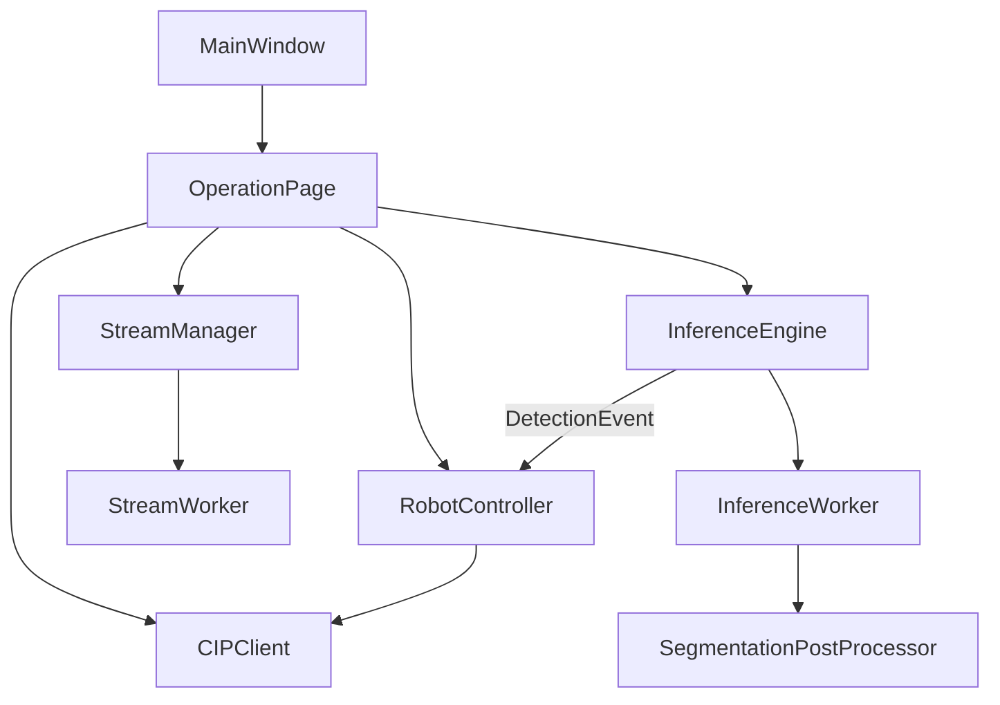

# Referência Técnica — Realtec Vision Buddmeyer

Documento de baixo nível para desenvolvimento, manutenção e integração CLP.

---

## 1. Mapa do repositório

```
realtec_vision_buddmeyer/
├── main.py                         # Entrada da aplicação
├── config/
│   ├── settings.py                 # Pydantic Settings
│   └── config.yaml                 # Configuração persistente
├── core/
│   ├── logger.py                   # structlog (system + process_trace)
│   ├── metrics.py                  # Métricas em memória
│   └── exceptions.py               # Exceções base
├── streaming/
│   ├── stream_manager.py           # Captura em QThread
│   ├── source_adapters.py          # video, usb, rtsp, gige, gentl
│   ├── frame_buffer.py
│   ├── stream_health.py
│   └── mjpeg_server.py             # HTTP MJPEG para navegador
├── detection/
│   ├── inference_engine.py         # Inferência + InferenceWorker
│   ├── model_loader.py             # Mask2Former / DETR fallback
│   ├── segmentation_postprocess.py
│   ├── mask_geometry.py            # PCA, centróide, ângulo, área
│   ├── postprocess.py              # Object detection (legado)
│   ├── events.py                   # DetectionResult, DetectionEvent
│   └── model_validator.py          # CLI check_model
├── preprocessing/
│   └── roi_manager.py              # ROI, clamp de centróide
├── communication/
│   ├── cip_client.py               # CIP + SimulatedPLC
│   ├── tag_map.py
│   ├── connection_state.py
│   └── cip_logger.py
├── control/
│   └── robot_controller.py         # Máquina de estados pick-and-place
├── ui/
│   ├── main_window.py
│   ├── pages/                      # operation, configuration, diagnostics
│   └── widgets/                    # video, status, charts, logs
├── model_best/                     # Mask2Former (Git LFS)
├── tests/
├── scripts/
│   ├── smoke_test_segmentation.py
│   └── check_model.py
├── installer/                      # PyInstaller Windows
└── docs/
```

## 2. Arquitetura runtime



- **GUI thread:** PySide6; atualizações via `Signal`/`Slot`.
- **Workers:** `StreamWorker` (captura), `InferenceWorker` (modelo).
- **Singletons:** `StreamManager`, `InferenceEngine`, `CIPClient`, `RobotController`, `MetricsCollector`.
- **Async:** `qasync` opcional em `main.py` para integração asyncio/Qt.

## 3. Pipeline de visão

Resumo; detalhe em [SEGMENTATION_PIPELINE.md](SEGMENTATION_PIPELINE.md).

1. Frame BGR do adapter de streaming.
2. `InferenceWorker` converte para PIL, `Mask2FormerImageProcessor`, inferência no device (auto → MPS/CUDA/CPU).
3. `SegmentationPostProcessor` → máscaras, scores, labels.
4. `mask_geometry.compute_mask_geometry` → centróide, ângulo, área.
5. `DetectionResult.best_by_priority` (confiança + área).
6. `DetectionEvent.to_plc_data()` → dict para CIP.

**Fallback:** se o modelo não for `instance_segmentation`, usa pipeline DETR/RT-DETR (`postprocess.py`).

## 4. Referência `config.yaml`

### `streaming`

| Chave | Tipo | Default | Descrição |
|-------|------|---------|-----------|
| `source_type` | str | `usb` | `video`, `usb`, `rtsp`, `gige`, `gentl` |
| `video_path` | str | `videos/test.mp4` | Arquivo MP4 |
| `usb_camera_index` | int | `0` | Índice câmera USB |
| `rtsp_url` | str | `""` | URL RTSP (só YAML; sem campo na UI Operação) |
| `gige_ip` / `gige_port` | | | Câmera GigE |
| `gentl_cti_path` | str | | Caminho CTI GenTL |
| `gentl_device_index` | int | `0` | Índice dispositivo GenTL |
| `gentl_max_dimension` | int | `1920` | Redimensionar lado maior (0 = off) |
| `gentl_target_fps` | float | `15` | FPS alvo GenTL |
| `loop_video` | bool | `true` | Loop de arquivo |

### `detection`

| Chave | Tipo | Default | Descrição |
|-------|------|---------|-----------|
| `model_path` | str | `model_best` | Pasta do modelo local |
| `default_model` | str | `model_best` | ID HuggingFace ou caminho local |
| `confidence_threshold` | float | `0.5` | Corte Mask2Former |
| `inference_fps` | int | `15` | FPS alvo de inferência |
| `device` | str | `auto` | `cpu`, `cuda`, `mps`, `auto` |
| `target_classes` | list | `["Embalagem"]` | Filtro de classes |
| `segmentation_mask_threshold` | float | `0.5` | Binarização máscara |
| `segmentation_overlap_mask_area_threshold` | float | `0.8` | Sobreposição máscaras |
| `segmentation_min_mask_pixels` | int | `64` | Área mínima máscara |
| `prioritize_area` | bool | `true` | Confiança + área na escolha |

### `preprocess`

| Chave | Descrição |
|-------|-----------|
| `roi` | `[x, y, width, height]` em px |
| `roi_calibration_mm_per_px` | Escala mm/px para exibição |

### `cip`

| Chave | Default | Descrição |
|-------|---------|-----------|
| `ip` | — | IP do CLP |
| `port` | `44818` | Porta CIP |
| `simulated` | `false` | PLC virtual |
| `io_retries` | `2` | Retentativas read/write |
| `auto_reconnect` | `true` | Reconexão automática |

### `robot_control`

| Chave | Default | Descrição |
|-------|---------|-----------|
| `ack_timeout` | `5.0` | Timeout ACK (s) |
| `pick_timeout` | `30.0` | Timeout pick (s) |
| `place_timeout` | `30.0` | Timeout place (s) |
| `authorization_timeout` | `30.0` | Autorização CLP (s) |
| `bypass_authorization` | `false` | Bypass para testes (só YAML) |

### `tags`

Mapeamento nome lógico → variável global no CLP. Ver [TAG_CONTRACT.md](TAG_CONTRACT.md).

### `output`

| Chave | Descrição |
|-------|-----------|
| `rtsp_enabled` | **Nome legado** — habilita stream **HTTP MJPEG** |
| `http_port` | Porta (ex.: `8080`) |
| `http_path` | Path (ex.: `/stream`) |

## 5. UI ↔ configuração

| Parâmetro | Editável na UI | Só YAML |
|-----------|----------------|---------|
| Fonte de vídeo (combo) | Operação | — |
| ROI | Operação + Config | — |
| IP/porta CLP | Configuração | — |
| Modelo (combo) | Configuração | — |
| `confidence_threshold` | Configuração | — |
| `target_classes`, `segmentation_*` | — | YAML |
| `rtsp_url`, `source_type: rtsp` | — | YAML |
| `bypass_authorization` | — | YAML |
| Nomes de tags | Configuração (se exposto) / YAML | `tags:` |

**Combo Operação:** Arquivo, USB, GigE, GenTL (sem RTSP).

## 6. Fontes de vídeo

| `source_type` | Adapter | UI |
|---------------|---------|-----|
| `video` | Arquivo MP4 | Sim |
| `usb` | OpenCV VideoCapture + warm-up | Sim |
| `gige` | GigE | Sim |
| `gentl` | Harvesters GenTL | Sim |
| `rtsp` | OpenCV RTSP | Não (só YAML) |

## 7. Contrato CLP

Ver [TAG_CONTRACT.md](TAG_CONTRACT.md). Tags de saída principais:

- `PRODUCT_DETECTED`, `CENTROID_X`, `CENTROID_Y`
- `CENTROID_ANGLE`, `OBJECT_AREA` (segmentação)
- `CONFIDENCE`, `DETECTION_COUNT`, `PROCESSING_TIME`
- Handshake: `VisionCtrl_VisionReady`, `VisionCtrl_DataSent`, `VisionCtrl_EchoAck`, etc.

## 8. Máquina de estados do robô

Estados em `RobotControlState` ([`control/robot_controller.py`](../control/robot_controller.py)):

`INITIALIZING` → `WAITING_AUTHORIZATION` → `DETECTING` → `SENDING_DATA` → `WAITING_ACK` → `WAITING_PICK` → `WAITING_PLACE` → `READY_FOR_NEXT`

- **Modo manual:** pausa em `WAITING_SEND_AUTHORIZATION` até operador autorizar.
- **SimulatedPLC:** ACK ~1.5s, pick ~4s, place ~5s.
- Timeouts lidos de `robot_control` no YAML.

## 9. Logging

| Ficheiro | Conteúdo |
|----------|----------|
| `logs/realtec_vision.log` | App, infra, erros (`get_logger`) |
| `logs/process_trace.log` | Eventos `realtec.trace.*` (`trace_event`) |

Eventos úteis: `config_saved`, `cip_connecting`, `cip_connected`, `cip_error`, `state_transition`, `inference_diagnostic`.

## 10. Build, testes e deploy

```bash
cd realtec_vision_buddmeyer
pip install -r requirements.txt
python -m pytest tests/ -v
python -m scripts.check_model
python -m scripts.smoke_test_segmentation --camera 0 --frames 30
```

- **Git LFS:** `git lfs pull` após clone — ver [CLONE_BOX_PC.md](CLONE_BOX_PC.md).
- **Installer Windows:** [installer/COMO_USAR_INSTALADOR.md](../installer/COMO_USAR_INSTALADOR.md).

## 11. Índice de manutenção

| Sintoma | Onde investigar |
|---------|-----------------|
| Sem detecções | `inference_diagnostic` no log; `confidence_threshold`; frame preto (warm-up USB) |
| CLP não conecta | `cip_connecting`, IP em `config.yaml`, firewall |
| Erro ao escrever tag | `cip_error`, nomes em `tags:` vs Sysmac Studio |
| UI travada | Workers em QThread; não bloquear GUI |
| Modelo não carrega | `model_best/`, Git LFS, `scripts/check_model.py` |
| Ângulo/área errados | `mask_geometry.py`, ROI, iluminação |

---

Documentos relacionados: [OVERVIEW.md](OVERVIEW.md), [GUIA_OPERADOR.md](GUIA_OPERADOR.md), [PICK_PLACE_EXPEDICAO.md](PICK_PLACE_EXPEDICAO.md).
